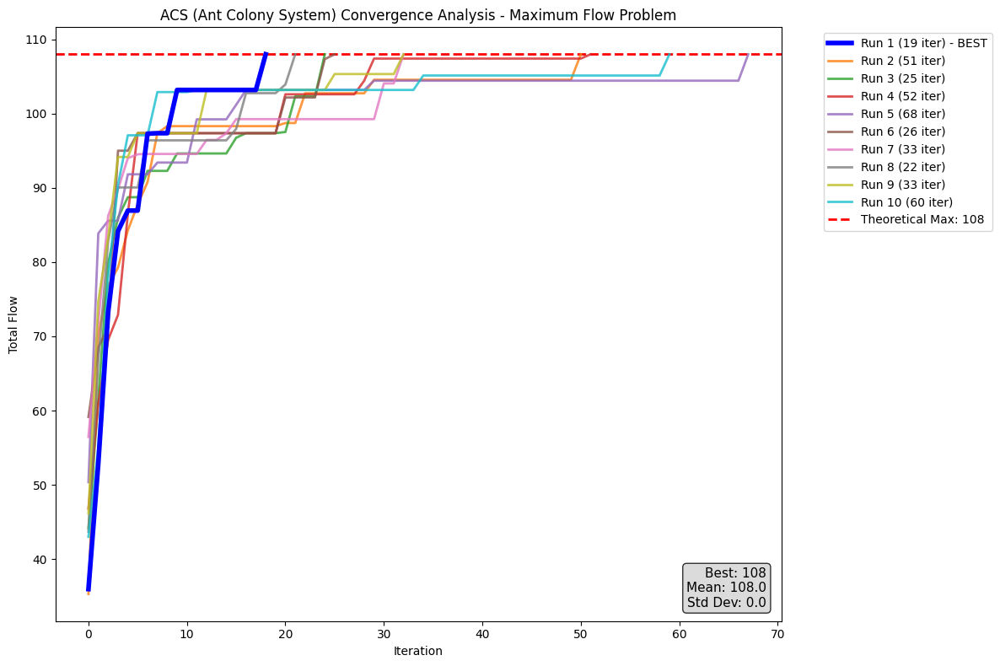

# Ant Colony Optimization per il Problema del Flusso Massimo

## Descrizione del Progetto

Questo progetto presenta un'implementazione dell'Ant Colony System (ACS) adattato per risolvere il Problema del Flusso Massimo. L'algoritmo utilizza formiche artificiali per trovare iterativamente percorsi aumentanti in una rete di flusso, con tracce di feromoni che guidano il processo di ricerca.

**Autore**: Giulio Pedicone (Matricola: 1000084718)  
**Corso**: Heuristics & Metaheuristics For Optimization And Learning


## Modifiche Rispetto all'ACS Classico

1. **Soft Exploitation**: Invece di scegliere deterministicamente il migliore, seleziona casualmente tra i top-K candidati
2. **Euristica Specifica**: Basata sulla capacità originale degli archi invece che su 1/distanza
3. **Numero di Formiche Adattivo**: Proporzionale ai successori del nodo sorgente
4. **Deposito Feromoni Modificato**: Basato sulla differenza dal flusso teorico massimo
5. **Criteri di Terminazione Specifici**: Per problemi di maximum flow


## Installazione e Setup

### 1. Clonare il repository o scaricare i file

### 2. Installare le dipendenze

```bash
pip install -r requirements.txt
```

### 3. Verifica dell'installazione

```bash
python -c "import numpy, matplotlib, networkx; print('Tutte le dipendenze installate correttamente')"
```

## Esecuzione

### Metodo 1: Jupyter Notebook (Raccomandato)

#### Passo 1: Avviare Jupyter
```bash
jupyter notebook
```

#### Passo 2: Aprire il notebook
- Nel browser che si apre, navigare e cliccare su `progetto.ipynb`

#### Passo 3: Eseguire l'analisi

Nella cella finale, modificare il file dell'istanza:
   ```python
   original_network = FlowNetwork("istanze/network_5760.txt")  # Cambiare qui
   ```

#### Passo 3: Eseguire tutte le celle

`Cell → Run All` o `Shift + Enter` su ogni cella


## Parametri dell'Algoritmo

L'implementazione ACS utilizza i seguenti parametri ottimizzati:

| Parametro | Simbolo | Valore | Descrizione |
|-----------|---------|--------|-------------|
| Peso Feromone | α | 1.0 | Influenza delle tracce di feromoni |
| Peso Euristica | β | 3.0 | Influenza dell'informazione euristica |
| Exploitation | q₀ | 0.8 | Parametro sfruttamento vs esplorazione |
| Evaporazione Locale | φ | 0.1 | Tasso decadimento locale feromoni |
| Evaporazione Globale | ρ | 0.3 | Tasso decadimento globale feromoni |
| Feromone Iniziale | τ₀ | 0.01 | Livello iniziale di feromoni |

## Risultati Sperimentali

### Setup Sperimentale
- **Numero di esecuzioni**: 10 run indipendenti per istanza
- **Iterazioni massime**: 20,000 per esecuzione
- **Semi casuali**: Diversi per ogni esecuzione per validità statistica

### Risultati per Istanze di Test

| Istanza | Best | Mean | Std Dev | Avg Iter | Avg Eval | Success Rate |
|---------|------|------|---------|----------|----------|--------------|
| network_160.txt | 34.68 | 34.68 | 0.00 | 4.8 | 13.3 | 100% |
| network_500.txt | 107.98 | 107.98 | 0.00 | 38.9 | 306.3 | 100% |
| network_960.txt | 117.74 | 117.74 | 0.00 | 17.9 | 157.2 | 100% |
| network_1440.txt | 134.00 | 134.00 | 0.00 | 121.1 | 1687.6 | 100% |
| network_2880.txt | 341.00 | 341.00 | 0.00 | 65.1 | 2004.2 | 100% |
| network_4320.txt | 555.00 | 555.00 | 0.00 | 446.9 | 25010.5 | 100% |
| network_5760.txt | 1203.00 | 1203.00 | 0.00 | 403.6 | 46762.2 | 100% |
| network_7200.txt | 2502.00 | 2502.00 | 0.00 | 549.3 | 125665.4 | 100% |
| network_11520.txt | 1244.00 | 1244.00 | 0.00 | 562.3 | 65172.6 | 100% |
| network_23040.txt | 2223.00 | 2223.00 | 0.00 | 493.1 | 112849.7 | 100% |

### Esempio di grafico di convergenza per la rete network_500.txt



#### Legenda Metriche:
- **Best**: Valore massimo del flusso trovato
- **Mean**: Media dei valori massimi su 10 prove
- **Std Dev**: Deviazione standard
- **Avg Iter**: Numero medio di iterazioni per raggiungere la migliore soluzione
- **Avg Eval**: Numero medio di valutazioni della funzione obiettivo
- **Success Rate**: Percentuale di esecuzioni che raggiungono l'ottimo teorico


## Contatti

**Giulio Pedicone**  
Matricola: 1000084718  
Email: pediconegiulio02@gmail.com